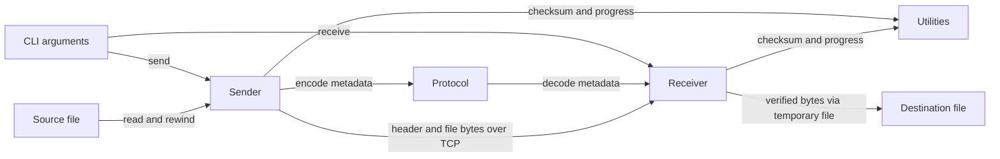

# Architecture

## Overview

Two invocations of the same CLI take complementary roles: the sender is a one-connection TCP server, and the receiver is a client. The CLI owns argument dispatch, each role owns its resource lifecycle, the protocol package owns binary metadata, and utilities supply CRC, port checking and terminal progress ([dispatch](../../main.go#L24), [sender](../../internal/sender/sender.go#L82), [receiver](../../internal/receiver/receiver.go#L39)).

## Components

| Component | Responsibility | Lives in | Talks to |
| --- | --- | --- | --- |
| CLI | Positional arguments, role construction, error exit. | [Root](../../main.go#L11), [inventory](03-structure.md#root) | Sender or receiver |
| Sender | Validate source, checksum, listen once, send exact byte count. | [internal/sender](../../internal/sender/), [inventory](03-structure.md#sender) | TCP, source file, protocol, utilities |
| Receiver | Dial, validate header, receive, verify and publish. | [internal/receiver](../../internal/receiver/), [inventory](03-structure.md#receiver) | TCP, local filesystem, protocol, utilities |
| Protocol | Encode/decode one versioned binary header. | [internal/protocol](../../internal/protocol/), [inventory](03-structure.md#protocol) | `io.Reader`, byte slices |
| Utilities | CRC32, valid ports and synchronous terminal progress. | [internal/utils](../../internal/utils/), [inventory](03-structure.md#utilities) | Readers, clock, stdout |

## Boundaries and contracts

- **CLI:** `send <file> <port>` or `receive [sender-ip] <output-file> <port>`. Invalid arity or commands print usage and return an error; `main` logs errors and exits 1 ([main.go:11](../../main.go#L11)).
- **Wire header:** big-endian fields are magic `P2PF` (4 bytes), version `1` (4), size (8), CRC32 (4), filename length (1), then 1–255 filename bytes. The fixed portion is 21 bytes. Encode derives magic, version and name length from constants/the string; it does not trust corresponding struct fields ([binary.go:9](../../internal/protocol/binary.go#L9), [binary.go:24](../../internal/protocol/binary.go#L24)).
- **Wire body:** raw bytes immediately follow the name. There are no per-chunk frames; the 2 KiB buffers are local I/O choices. Both ends bound their loops by the advertised size, and the receiver does not require EOF after that size ([sender.go:125](../../internal/sender/sender.go#L125), [receiver.go:142](../../internal/receiver/receiver.go#L142)).
- **Header trust:** decode requires matching magic/version and a nonempty name. Receiver additionally rejects sizes above `MaxInt64` and names differing from the platform's `filepath.Base`; the name is displayed, while the CLI output path controls storage ([binary.go:45](../../internal/protocol/binary.go#L45), [receiver.go:76](../../internal/receiver/receiver.go#L76)).
- **Success:** sender success means its writes completed. Receiver success additionally requires CRC match and publication. There is no result message back to the sender ([sender.go:114](../../internal/sender/sender.go#L114), [receiver.go:114](../../internal/receiver/receiver.go#L114)).

## Data model

These are transient Go structures and files, not database entities ([header](../../internal/protocol/binary.go#L15), [sender](../../internal/sender/sender.go#L15), [receiver](../../internal/receiver/receiver.go#L18)).

| Entity | Stored in | Key fields | Defined at |
| --- | --- | --- | --- |
| Sender configuration | Process memory | Port, source FileName | [sender.go:15](../../internal/sender/sender.go#L15) |
| Receiver configuration | Process memory | Address, Port, destination FileName | [receiver.go:18](../../internal/receiver/receiver.go#L18) |
| FileHeader | TCP bytes and memory | Protocol, Version, Size, CRC, NameLen, Name | [binary.go:15](../../internal/protocol/binary.go#L15) |
| ProgressBar | Process memory | Byte counters, start time, render throttle | [progress.go:9](../../internal/utils/progress.go#L9) |
| Received file | Temporary inode, then destination hard link | Raw file bytes; source permissions/timestamps are not transmitted | [receiver.go:85](../../internal/receiver/receiver.go#L85) |

## State and persistence

The source is opened once but read twice: first for CRC and then for transmission after a seek. It is not snapshotted or locked ([sender.go:40](../../internal/sender/sender.go#L40)). The receiver writes a hidden `.OUTPUT.part-*` file in the destination directory, rereads it for CRC, syncs and closes it, creates the destination as a hard link, then removes the temporary name ([receiver.go:85](../../internal/receiver/receiver.go#L85)). Existing paths are rejected both before dialing and by the hard-link operation, closing the overwrite race ([receiver.go:49](../../internal/receiver/receiver.go#L49), [receiver.go:126](../../internal/receiver/receiver.go#L126)).

Errors before publication normally remove the temporary file through a defer. Abrupt process death cannot execute that defer, and cleanup failures are ignored there; no restart/resume state or orphan cleanup exists in this lifecycle. File sync is explicit, directory sync is absent, so crash-durable publication is not established ([receiver.go:93](../../internal/receiver/receiver.go#L93), [receiver.go:117](../../internal/receiver/receiver.go#L117)).

## Deployment

`make build` creates `bin/p2p-share` for the active Go platform ([Makefile:3](../../Makefile#L3)). The sender binds an empty host address, making the chosen port available on wildcard interfaces according to the OS; the receiver dials the supplied address or `localhost` ([sender.go:69](../../internal/sender/sender.go#L69), [main.go:33](../../main.go#L33)). There is no relay, NAT traversal, service manager or container definition in the [tracked inventory](03-structure.md#what-lives-where); direct reachability is a deployment prerequisite ([README.md:93](../../README.md#L93)).

## Failure and scale

- Dial timeout is 10 seconds; complete-header timeout is 30 seconds. Receiver body reads each have a fresh 30-second deadline, and sender individual writes each refresh a 30-second deadline. A receiver body deadline covers completion of the current `io.ReadFull`, so slow partial progress does not extend it ([receiver.go:57](../../internal/receiver/receiver.go#L57), [receiver.go:155](../../internal/receiver/receiver.go#L155), [sender.go:153](../../internal/sender/sender.go#L153)).
- Sender waits indefinitely in `Accept` unless its caller cancels; the default CLI uses a background context. Context cancellation closes listener/connection handles; filesystem and CRC operations remain synchronous ([sender.go:30](../../internal/sender/sender.go#L30), [sender.go:82](../../internal/sender/sender.go#L82), [receiver.go:62](../../internal/receiver/receiver.go#L62)).
- Corruption, premature EOF and output conflicts return errors without automatic retry. CRC is not authentication, and plain TCP exposes file contents to the network ([receiver.go:114](../../internal/receiver/receiver.go#L114), [receiver.go:158](../../internal/receiver/receiver.go#L158), [documented limits](../../README.md#L131)).
- Each sender accepts one client and exits. Memory consumption for payload streaming is bounded by fixed buffers, but source CRC and receiver CRC add full-file disk passes, and the receiver requires space for the complete file. There is no concurrency scheduler or multi-client accept loop ([sender.go:90](../../internal/sender/sender.go#L90), [sender.go:125](../../internal/sender/sender.go#L125), [crc.go:14](../../internal/utils/crc.go#L14)).
