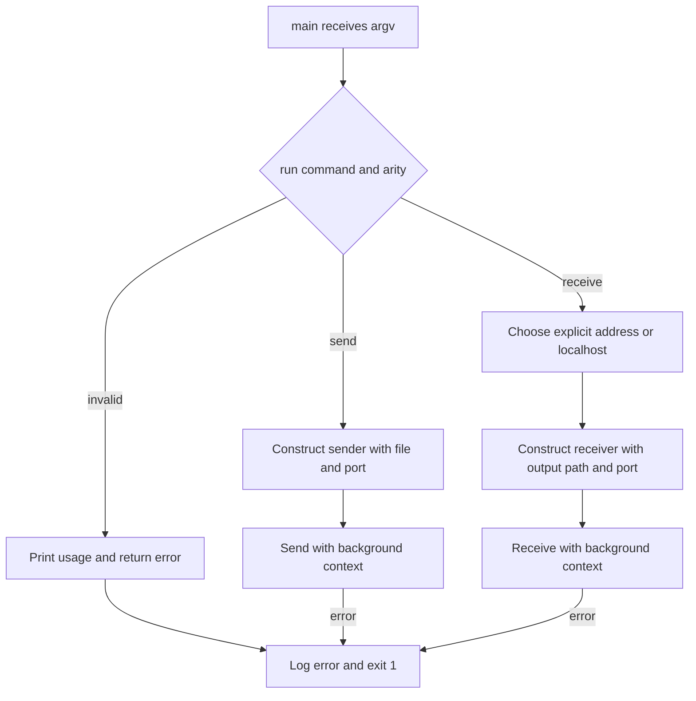
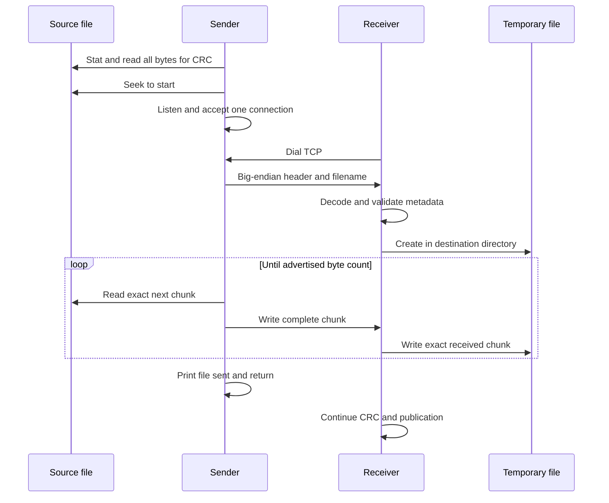
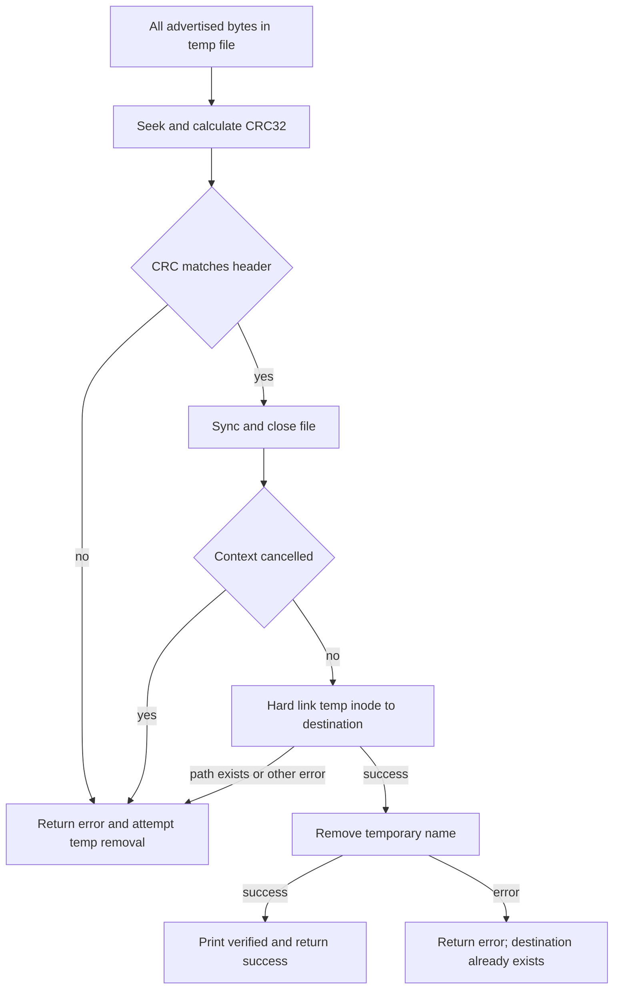
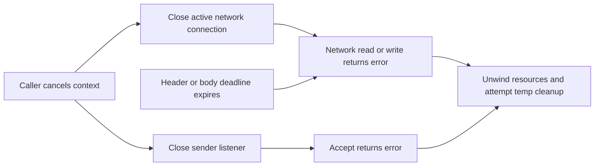
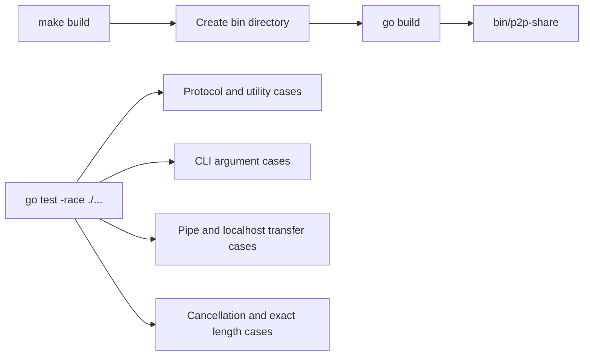

# Flow

## Startup

1. **Dispatch:** `main` passes `os.Args[1:]` to `run`; missing or unknown command and invalid argument counts return errors. [`main.go:11`](../../main.go#L11) · [structure](03-structure.md#root).
2. **Sender setup:** construct `Sender` with port and source path. `Send` wraps `SendContext(context.Background())`, which checks cancellation and validates the port before opening a regular file and validating its basename length. [`main.go:25`](../../main.go#L25), [`sender.go:30`](../../internal/sender/sender.go#L30) · [root](03-structure.md#root), [sender structure](03-structure.md#sender).
3. **Receiver setup:** accept either output/port or address/output/port; default the address to localhost. `Receive` wraps a background context, validates port and nonempty output, and uses `Lstat` to reject any already existing output path, including a symlink. [`main.go:32`](../../main.go#L32), [`receiver.go:37`](../../internal/receiver/receiver.go#L37) · [root](03-structure.md#root), [receiver structure](03-structure.md#receiver).
4. **Exit:** role errors propagate to `main`, which logs and exits with status 1; successful return exits normally. [`main.go:11`](../../main.go#L11) · [structure](03-structure.md#root).

## File transfer

1. **Precompute integrity metadata:** the sender stats the open file, computes IEEE CRC32 using an 8 KiB scratch buffer, then seeks back to offset zero. File size comes from the earlier stat; a stable source is required. [`sender.go:46`](../../internal/sender/sender.go#L46), [`crc.go:11`](../../internal/utils/crc.go#L11) · [sender](03-structure.md#sender), [utilities](03-structure.md#utilities).
2. **Connect:** sender listens on the chosen wildcard port and accepts one connection; receiver dials with a 10-second timeout. Context callbacks close the listener/connection if cancelled. [`sender.go:69`](../../internal/sender/sender.go#L69), [`sender.go:82`](../../internal/sender/sender.go#L82), [`receiver.go:55`](../../internal/receiver/receiver.go#L55) · [sender](03-structure.md#sender), [receiver](03-structure.md#receiver).
3. **Write metadata:** build the `FileHeader`, encode its fixed 21 bytes plus basename, and use `writeAll` to cope with short TCP writes. [`sender.go:100`](../../internal/sender/sender.go#L100), [`binary.go:24`](../../internal/protocol/binary.go#L24), [`sender.go:153`](../../internal/sender/sender.go#L153) · [sender](03-structure.md#sender), [protocol](03-structure.md#protocol).
4. **Read metadata:** receiver sets a 30-second header deadline; decode uses `io.ReadFull` for the fixed bytes and name, checks magic/version/nonempty name, and the receiver rejects oversized lengths or non-basename names before creating a temporary file. [`receiver.go:66`](../../internal/receiver/receiver.go#L66), [`binary.go:45`](../../internal/protocol/binary.go#L45), [`receiver.go:85`](../../internal/receiver/receiver.go#L85) · [receiver](03-structure.md#receiver), [protocol](03-structure.md#protocol).
5. **Stream exact bytes:** sender reads at most 2 KiB at a time with `io.ReadFull` and writes all bytes, stopping at the stat size. Receiver independently reads exact chunks until the header size, writing them to the temporary file. Early EOF is an error; bytes beyond the advertised count are not consumed. [`sender.go:125`](../../internal/sender/sender.go#L125), [`receiver.go:142`](../../internal/receiver/receiver.go#L142) · [sender](03-structure.md#sender), [receiver](03-structure.md#receiver).
6. **Render progress and end sending:** each completed chunk updates a local progress bar, throttled to 100 ms. Sender returns after writing; receiver advances to verification below. A zero-byte body skips both loops. [`progress.go:20`](../../internal/utils/progress.go#L20), [`sender.go:148`](../../internal/sender/sender.go#L148), [`receiver.go:100`](../../internal/receiver/receiver.go#L100) · [utilities](03-structure.md#utilities), [sender](03-structure.md#sender), [receiver](03-structure.md#receiver).

## Verification and publication

1. **Verify:** receiver seeks the temporary file to zero, recomputes CRC and compares it with metadata; mismatch returns an error. [`receiver.go:104`](../../internal/receiver/receiver.go#L104), [`crc.go:11`](../../internal/utils/crc.go#L11) · [receiver](03-structure.md#receiver), [utilities](03-structure.md#utilities).
2. **Prepare publication:** sync and close the file, then check the context. This is a point-in-time check, not an atomic guarantee against cancellation between the check and the following link. [`receiver.go:117`](../../internal/receiver/receiver.go#L117) · [structure](03-structure.md#receiver).
3. **Publish without clobbering:** `os.Link(tempName, destination)` creates the final name; if another process has created that name since the early check, linking fails instead of replacing it. Remove the temporary name and mark publication complete. [`receiver.go:126`](../../internal/receiver/receiver.go#L126) · [structure](03-structure.md#receiver).
4. **Report/cleanup:** print success only after temporary-name removal. The deferred cleanup closes the handle and attempts to remove the temporary path on failure. If unlink fails after a successful link, the method returns an error although the verified destination already exists; it does not roll back that destination. [`receiver.go:93`](../../internal/receiver/receiver.go#L93), [`receiver.go:132`](../../internal/receiver/receiver.go#L132) · [structure](03-structure.md#receiver).

## Cancellation and timeouts

1. **API cancellation:** `SendContext` and `ReceiveContext` reject an already-cancelled context. Sender installs callbacks for listener and accepted socket; receiver uses `DialContext` then a callback for its socket. Ordinary wrappers use background contexts. [`sender.go:30`](../../internal/sender/sender.go#L30), [`sender.go:82`](../../internal/sender/sender.go#L82), [`receiver.go:37`](../../internal/receiver/receiver.go#L37), [`receiver.go:57`](../../internal/receiver/receiver.go#L57) · [sender](03-structure.md#sender), [receiver](03-structure.md#receiver).
2. **Bound network operations:** header deadline covers the entire header; receiver refreshes the body deadline before each `io.ReadFull`, while sender refreshes before each individual write. Errors are wrapped with operation context; cancellation often surfaces as a closed-network error rather than `context.Canceled`. [`receiver.go:66`](../../internal/receiver/receiver.go#L66), [`receiver.go:155`](../../internal/receiver/receiver.go#L155), [`sender.go:153`](../../internal/sender/sender.go#L153) · [receiver](03-structure.md#receiver), [sender](03-structure.md#sender).
3. **Limits:** CRC calculation has no context parameter, file operations have no cancellation hook, and `main` has no signal-to-context wiring. Deferred cleanup covers returns through Go code, not arbitrary process death. [`crc.go:11`](../../internal/utils/crc.go#L11), [`receiver.go:93`](../../internal/receiver/receiver.go#L93), [`main.go:11`](../../main.go#L11) · [utilities](03-structure.md#utilities), [receiver](03-structure.md#receiver), [root](03-structure.md#root).

## Build and tests

1. **Build:** Make creates the output directory and invokes `go build -o ./bin/p2p-share`; it defines clean and executable targets but no test target. [`Makefile:1`](../../Makefile#L1) · [structure](03-structure.md#root).
2. **Pure and dispatch checks:** Go's test runner discovers header encoding/decoding, CRC/port and CLI argument tests. [`binary_test.go:10`](../../internal/protocol/binary_test.go#L10), [`crc_test.go:18`](../../internal/utils/crc_test.go#L18), [`network_test.go:5`](../../internal/utils/network_test.go#L5), [`main_test.go:8`](../../main_test.go#L8) · [protocol](03-structure.md#protocol), [utilities](03-structure.md#utilities), [root](03-structure.md#root).
3. **I/O and lifecycle checks:** sender tests exercise partial writes and a 5,000-byte localhost transfer; receiver tests cover empty/nonempty files, existing destination, CRC failure, truncation and header timeout. Sender lifecycle tests cover cancelled accept and exact source-length behavior. [`sender_test.go:26`](../../internal/sender/sender_test.go#L26), [`receiver_test.go:48`](../../internal/receiver/receiver_test.go#L48), [`lifecycle_test.go:12`](../../internal/sender/lifecycle_test.go#L12) · [sender](03-structure.md#sender), [receiver](03-structure.md#receiver).

The recorded v1 validation command is `go test -race ./...` ([delivery evidence](../../HISTORY.md#L42)); this guide describes that evidence and does not assert new test execution. Coverage gaps are listed in [Open questions](README.md#open-questions).
